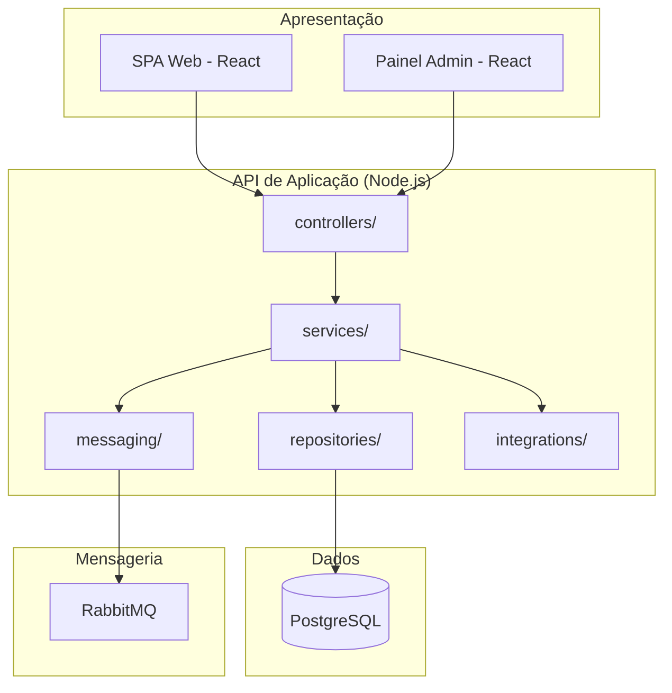

# 🛠️ Visão de Desenvolvimento — ShopSimples

> Parte do Modelo 4+1 de Visões Arquiteturais. Esta visão organiza o software em
> **módulos, pacotes e camadas** sob a perspectiva da equipe de desenvolvimento.

---

## 1. Objetivo

Descrever como o código-fonte do **ShopSimples** está organizado em camadas e pacotes,
servindo de guia para onde cada tipo de mudança deve ser implementada.

---

## 2. Camadas da arquitetura

| Camada | Tecnologia | Responsabilidade |
| --- | --- | --- |
| Apresentação | React + TypeScript (SPA Web e Painel Administrativo) | Interface do usuário, chamadas à API |
| Negócio | Node.js + Express (API de Aplicação) | Regras de negócio, orquestração, validações |
| Dados | PostgreSQL | Persistência de produtos, pedidos, usuários e pagamentos |
| Mensageria | RabbitMQ | Desacoplamento de processamento assíncrono |

> 🔗 Estas camadas correspondem diretamente aos containers definidos em
> [`diagramas/c2-container.puml`](../diagramas/c2-container.puml).

---

## 3. Estrutura de pacotes — API de Aplicação

```
api/
├── src/
│   ├── controllers/         # Camada de apresentação da API (Express Routers)
│   │   ├── catalogo.controller.ts
│   │   ├── carrinho.controller.ts
│   │   ├── pedido.controller.ts
│   │   └── usuario.controller.ts
│   │
│   ├── services/            # Regras de negócio (camada de domínio)
│   │   ├── catalogo.service.ts
│   │   ├── carrinho.service.ts
│   │   ├── pedido.service.ts
│   │   ├── pagamento.service.ts
│   │   └── usuario.service.ts
│   │
│   ├── repositories/        # Camada de acesso a dados
│   │   ├── produto.repository.ts
│   │   ├── pedido.repository.ts
│   │   └── usuario.repository.ts
│   │
│   ├── models/               # Entidades de domínio (Order, Product, User...)
│   ├── messaging/            # Publishers/Consumers do RabbitMQ
│   ├── integrations/         # Clientes HTTP para Gateway de Pagamento, Frete, E-mail
│   └── config/                # Configuração de banco, fila, variáveis de ambiente
│
└── tests/
    ├── unit/
    └── integration/
```

> 🔗 Os pacotes `controllers/`, `services/` e `repositories/` correspondem,
> respectivamente, aos componentes Controller, Serviço e Repositório descritos em
> [`diagramas/c3-component-api.puml`](../diagramas/c3-component-api.puml).
> A classe `OrderService` detalhada em
> [`diagramas/c4-code-servico-pedidos.puml`](../diagramas/c4-code-servico-pedidos.puml)
> corresponde ao arquivo `services/pedido.service.ts`.

---

## 4. Diagrama de Pacotes



---

## 5. Convenções de desenvolvimento

- **Dependência em uma direção só**: `controllers → services → repositories`. Repositórios nunca chamam serviços, e serviços nunca chamam controllers.
- **Integrações externas** (Gateway de Pagamento, Frete, E-mail) ficam isoladas em `integrations/`, nunca chamadas diretamente por `controllers/`.
- Cada módulo de domínio (catálogo, carrinho, pedido, usuário) deve ter testes unitários cobrindo a camada `services/`.
- Migrations de banco de dados seguem versionamento sequencial (ex.: `0001_create_produtos.sql`), nunca alteração direta de migration já aplicada em produção.

---

## 6. Rastreabilidade

| Pacote/Módulo                        | Componente C4 (C3)      | Visão Lógica relacionada                         |
| ------------------------------------ | ----------------------- | ------------------------------------------------ |
| `services/pedido.service.ts`         | Serviço de Pedidos      | [Pedido, Finalização de Compra](visao-logica.md) |
| `services/pagamento.service.ts`      | Serviço de Pagamento    | [Módulo de Pagamento](visao-logica.md)           |
| `repositories/produto.repository.ts` | Repositório de Produtos | [Catálogo de Produtos](visao-logica.md)          |
