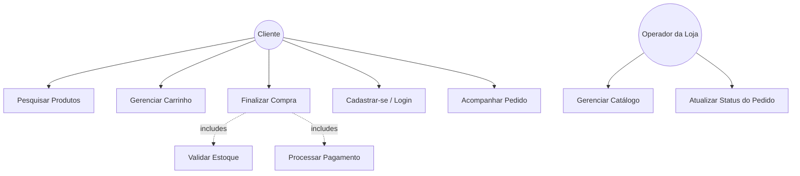
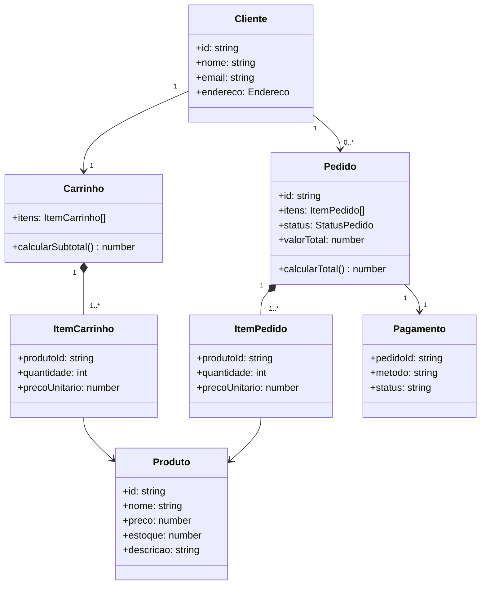

# 🧩 Visão Lógica — ShopSimples

> Parte do Modelo 4+1 de Visões Arquiteturais. Esta visão mostra **o que o sistema faz**
> na perspectiva do usuário final, descrevendo as principais abstrações funcionais e
> seus relacionamentos.

---

## 1. Objetivo

Descrever as funcionalidades do **ShopSimples** — uma loja virtual simples — do ponto de
vista de quem usa o sistema (cliente final) e de quem administra o catálogo (operador da
loja), independentemente de como essas funcionalidades são implementadas tecnicamente.

---

## 2. Funcionalidades principais

| Funcionalidade | Descrição | Ator |
| --- | --- | --- |
| Catálogo de Produtos | Pesquisar, filtrar e visualizar detalhes de produtos | Cliente |
| Carrinho de Compras | Adicionar, remover e atualizar quantidade de itens | Cliente |
| Módulo de Pagamento | Escolher forma de pagamento e confirmar compra | Cliente |
| Gestão de Usuários | Cadastro, login e gerenciamento de dados da conta | Cliente |
| Gestão de Catálogo | Cadastrar, editar e remover produtos | Operador da Loja |
| Gestão de Pedidos | Consultar e atualizar status de pedidos | Operador da Loja |

---

## 3. Diagrama de Casos de Uso

> 💡 Para a versão formal em notação UML (`usecase`), ver
> [`diagramas/visao-logica-casos-de-uso.puml`](../diagramas/) — pode ser gerado a partir
> desta lista sempre que a equipe optar por uma representação UML mais rigorosa.

---

## 4. Diagrama de Classes (modelo conceitual de domínio)

Classes de domínio que sustentam as funcionalidades acima — independentes de tabelas de
banco de dados ou frameworks (essa correspondência fica a cargo da Visão de Desenvolvimento):

> 🔗 Este modelo conceitual corresponde, em nível de implementação, às classes detalhadas
> em [`diagramas/c4-code-servico-pedidos.puml`](../diagramas/c4-code-servico-pedidos.puml)
> e aos componentes descritos em
> [`diagramas/c3-component-api.puml`](../diagramas/c3-component-api.puml).

---

## 5. Regras de negócio relevantes

- Um pedido só pode ser criado se houver estoque suficiente para todos os itens do carrinho.
- O valor total do pedido é recalculado no momento da criação (não confia no valor enviado pelo cliente).
- Um cliente não pode finalizar a compra sem estar autenticado.
- O operador da loja não pode excluir um produto que esteja presente em pedidos com status diferente de `CANCELADO`.

---

## 6. Rastreabilidade

| Funcionalidade        | ADR relacionada                                          | Visão de Processos                       | Diagrama C4 |
| --------------------- | -------------------------------------------------------- | ---------------------------------------- | ----------- |
| Finalização de Compra | [`ADR-001`](../adrs/ADR-001-fluxo-finalizacao-compra.md) | [Visão de Processos](visao-processos.md) | C2, C3      |
