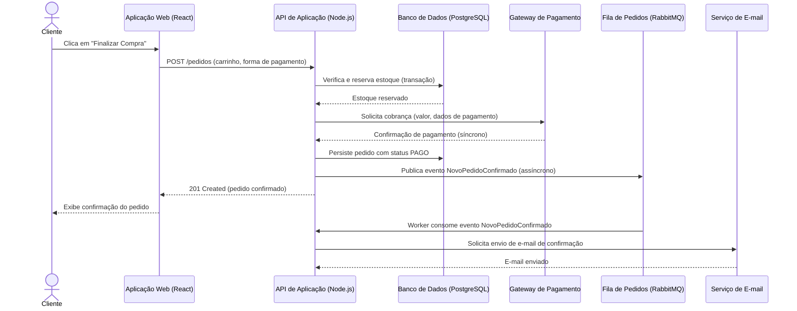

# ⚙️ Visão de Processos — ShopSimples

> Parte do Modelo 4+1 de Visões Arquiteturais. Esta visão foca no **fluxo de dados,
> concorrência, comunicação entre serviços e desempenho** em tempo de execução.

---

## 1. Objetivo

Descrever como o **ShopSimples** se comporta durante a execução, especialmente no
fluxo crítico de finalização de compra, incluindo comunicação síncrona e assíncrona
entre os containers definidos em
[`diagramas/c2-container.puml`](../diagramas/c2-container.puml).

---

## 2. Fluxo principal: Finalização de Compra

1. **Processo A** — O cliente adiciona um item ao carrinho (validação síncrona de disponibilidade).
2. **Processo B** — Ao finalizar a compra, a API reserva o estoque no banco de dados (operação transacional).
3. **Processo C** — A API solicita a cobrança ao Gateway de Pagamento externo (chamada síncrona via REST).
4. **Processo D** — Após confirmação do pagamento, a API publica um evento `NovoPedidoConfirmado` na fila (assíncrono).
5. **Processo E** — Um worker consome o evento da fila e dispara a emissão de nota fiscal e o e-mail de confirmação.

---

## 3. Diagrama de Sequência — Finalização de Compra

> 🔗 Os participantes deste diagrama correspondem 1:1 aos containers de
> [`diagramas/c2-container.puml`](../diagramas/c2-container.puml).

---

## 4. Concorrência e consistência

| Cenário | Estratégia adotada |
| --- | --- |
| Dois clientes tentam comprar o último item em estoque simultaneamente | Reserva de estoque via transação com lock otimista na tabela `produtos` |
| Falha na chamada ao Gateway de Pagamento | Pedido permanece em `AGUARDANDO_PAGAMENTO`; estoque é liberado após timeout configurável |
| Falha no envio de e-mail de confirmação | Não bloqueia a confirmação do pedido — reprocessamento assíncrono via fila com retry |

---

## 5. Desempenho — metas não-funcionais do fluxo crítico

| Etapa | Meta de tempo de resposta | Observação |
| --- | --- | --- |
| Consulta ao catálogo | < 300 ms (p95) | Cache de leitura pode ser avaliado futuramente |
| Reserva de estoque | < 200 ms (p95) | Operação transacional local ao banco |
| Confirmação de pagamento (chamada externa) | < 3 s (p95) | Depende de SLA do Gateway de Pagamento |
| Processamento assíncrono (e-mail/NF) | Até 1 minuto após confirmação | Não bloqueia a experiência do cliente |

---

## 6. Rastreabilidade

| Processo               | Container envolvido (C2)         | Componente envolvido (C3)                | ADR relacionada                                          |
| ---------------------- | -------------------------------- | ---------------------------------------- | -------------------------------------------------------- |
| Reserva de estoque     | API de Aplicação, Banco de Dados | Serviço de Carrinho, Serviço de Catálogo | [`ADR-001`](../adrs/ADR-001-fluxo-finalizacao-compra.md) |
| Cobrança               | API de Aplicação                 | Serviço de Pagamento                     | [`ADR-001`](../adrs/ADR-001-fluxo-finalizacao-compra.md) |
| Notificação assíncrona | Fila de Processamento de Pedidos | Serviço de Pedidos                       | [`ADR-001`](../adrs/ADR-001-fluxo-finalizacao-compra.md) |
