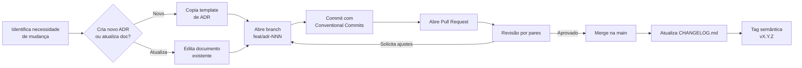

# 🏛️ ArchVault Versioner

<p align="center">
  

  <a href="https://git-scm.com">
  
  </a>

  <a href="https://github.com/guisantoslima/ArchVault-Versioner">
  
  </a>

  <a href="https://github.com/guisantoslima/ArchVault-Versioner/commits/main/">
  
  </a>

  <a href="https://github.com/guisantoslima/ArchVault-Versioner/blob/main/LICENSE">
  
  </a>

</p>

<strong>Versionamento inteligente de documentação arquitetural usando Git & GitHub como fonte única da verdade.</strong>

</br>

### 📑 Navegue pelo projeto

| 🚀 [Início rápido](#-início-rápido) | 🏗️ [Estrutura](#-estrutura-do-repositório) | 📋 [Workflow](#-workflow-de-versionamento) | 🤝 [Contribuição](#-como-contribuir) | 📜 [Changelog](#-changelog) |
|:-----------------------------------:|:------------------------------------------:|:-------------------------------------------:|:------------------------------------:|:---------------------------:|

---

## 🎯 Visão geral

O **ArchDoc Versioner** é um repositório modelo para organizar, rastrear e evoluir documentação arquitetural de software com o mesmo rigor usado para código-fonte, utilizando o poder de correlação e centralização de documentação da ferramenta Obsidian.

> *"Arquitetura que não é versionada é arquitetura que não existe."*

### ✨ Por que versionar documentação arquitetural?

- **Rastreabilidade**: saiba quem mudou o quê, quando e por quê.
- **Revisão colaborativa**: Pull Requests para decisões arquiteturais.
- **Histórico evolutivo**: entenda como a arquitetura mudou ao longo do tempo.
- **Fonte única da verdade**: diagramas, ADRs e glossário sempre sincronizados.
- **Integração com CI/CD**: valide links, diagramas e estilo automaticamente.

---

## 🚀 Início rápido

### 1. Clone o template

```bash
git clone https://github.com/guisantoslima/ArchVault-Versioner.git archvault-versioner
cd archvault-versioner
```

### 2. Configure seu ambiente

```bash
git config --local user.name "Seu Nome"
git config --local user.email "seu.email@example.com"
```

### 3. Crie sua primeira decisão arquitetural

```bash
git checkout -b feat/arch-001-escolha-banco-dados
cp docs/archs/_template.md docs/adrs/ADR-001-escolha-banco-de-dados.md
# edite o arquivo...
git add .
git commit -m "feat(adr): adiciona ADR-001 sobre escolha do banco de dados"
```

---

## 🏗️ Estrutura do repositório

```text
📦 archvault-versioner
 ├──📁 .obsidian
 ├──📁 ArchVault/
 │  ├── 📁 docs/
 │  │   ├── 📁 adrs/                    # Architecture Decision Records
 │  │   │   ├── ADR-001-ex.md
 │  │   │   └── _template.md
 │  │   ├── 📁 diagrams/               # C4, UML, fluxos de dados
 │  │   │   ├── 📁 C1
 │  │   │   │   └── contexto-ex.puml
 │  │   │   ├── 📁 C2
 │  │   │   │   └── container-ex.puml
 │  │   │   ├── 📁 C3
 │  │   │   │   └── component-ex.puml
 │  │   │   ├── 📁 C4
 │  │   │   │   └── code-ex.puml
 │  │   ├── 📁 views/                  # Visões arquiteturais (lógica, física, etc.)
 │  │   │   ├── visao-logica.md
 │  │   │   ├── visao-processos.md
 │  │   │   ├── visao-desenvolvimento.md
 │  │   │   ├── visao-fisica.md
 │  │   │   └── visao-cenarios.md
 │  │   ├── 📁 roadmaps/               # Roadmaps e Planejamentos
 │  │   │   └── roadmap-2026.md
 │  │   └── README.md                   # Guia de navegação dos docs
 │  ├── 📁 .github/
 │  │   ├── 📁 workflows/               # CI/CD para docs
 │  │   │   ├── links.yml
 │  │   │   └── diagrams.yml
 │  │   ├── PULL_REQUEST_TEMPLATE.md
 │  │   └── ISSUE_TEMPLATE/
 │  │       ├── nova-decisao-arquitetural.md
 │  │       └── revisao-de-documento.md
 │  └── 📁 scripts/
 │      ├── novo-adr.sh
 │      └── verificar-links.sh
 ├── CHANGELOG.md
 ├── CONTRIBUTING.md
 ├── LICENSE.md
 ├── README.md
 └── SECURITY.md
```

---

## 🔄 Workflow de versionamento



### 📌 Convenção de commits

Use **Conventional Commits** para manter o histórico legível e gerar changelog automaticamente.

| Tipo           | Quando usar                 | Exemplo                                                 |
| -------------- | --------------------------- | ------------------------------------------------------- |
| `feat(adr)`    | Nova decisão arquitetural   | `feat(adr): ADR-003 escolha de message broker`          |
| `docs(diag)`   | Novo ou atualizado diagrama | `docs(diag): atualiza C4 de containers`                 |
| `docs(visao)`  | Nova visão arquitetural     | `docs(visao): adiciona visão de segurança`              |
| `fix(gloss)`   | Correção no glossário       | `fix(gloss): corrige definição de saga`                 |
| `chore(tools)` | Ferramentas e scripts       | `chore(tools): adiciona script de verificação de links` |

### 🏷️ Versionamento semântico para documentação

Aplicamos versionamento semântico ao conteúdo do repositório:

| Versão  | Significado                           | Exemplo  |
| ------- | ------------------------------------- | -------- |
| `MAJOR` | Arquitetura completamente redesenhada | `v2.0.0` |
| `MINOR` | Nova ADR, nova visão, novo diagrama   | `v1.3.0` |
| `PATCH` | Correções, revisões menores, typo     | `v1.3.2` |

---

## 📝 Templates prontos

### 🏛️ ADR — Architecture Decision Record

Acesse o template completo em [`docs/adrs/_template.md`](_template.md) ou use o script:

```bash
./scripts/novo-adr.sh "escolha do message broker"
```

### 🖼️ Diagrama C4 — PlantUML

```plantuml
@startuml C4_Contexto
!include https://raw.githubusercontent.com/plantuml-stdlib/C4-PlantUML/master/C4_Context.puml

Person(usuario, "Usuário", "Usuário final do sistema")
System(sistema, "Sistema", "Plataforma de versionamento de docs")
System_Ext(github, "GitHub", "Repositório e revisão colaborativa")

Rel(usuario, sistema, "Acessa")
Rel(sistema, github, "Sincroniza docs")

SHOW_LEGEND()
@enduml
```

---

## 🤝 Como contribuir

1. Leia o [`CONTRIBUTING.md`](CONTRIBUTING.md).
2. Verifique se já existe uma [issue](https://github.com/seu-org/archvault-versioner/issues) relacionada.
3. Crie uma branch a partir da `main`: `feat/adr-NNN-descricao-curta`.
4. Faça commits claros com Conventional Commits.
5. Abra um Pull Request usando o template fornecido.
6. Solicite revisão de pelo menos **1 arquiteto ou tech lead**.

### ✅ Checklist de Pull Request

- [ ] O documento segue o template correspondente.
- [ ] Links internos e externos foram verificados.
- [ ] Diagramas foram renderizados sem erros.
- [ ] O CHANGELOG.md foi atualizado.
- [ ] A versão semântica foi atualizada, se necessário.

---

## 📜 Changelog

Mudanças documentadas seguem o formato [Keep a Changelog](https://keepachangelog.com/pt-BR/1.0.0/).

```text

 Versão | Data | Solution Request | Feature| Branch | Responsável | Changes (PR)

```

Veja o histórico completo em [`CHANGELOG.md`](CHANGELOG.md).

---

## 🛠️ Ferramentas recomendadas

| Ferramenta   | Uso                            | Link                                        |
| ------------ | ------------------------------ | ------------------------------------------- |
| Git          | Versionamento de código e docs | https://git-scm.com                         |
| GitHub       | Repositório, PRs e Issues      | https://github.com                          |
| PlantUML     | Diagramas C4 e UML             | https://plantuml.com                        |
| Mermaid      | Diagramas em Markdown          | https://mermaid-js.github.io                |
| Markdownlint | Padronização de Markdown       | https://github.com/DavidAnson/markdownlint  |
| Obsidian     | Anotações Markdown Link        | [https://obsidian.md](https://obsidian.md/) |

---

## 📚 Leitura recomendada

- 📖 [Documenting Software Architectures](https://www.amazon.com/Documenting-Software-Architectures-Views-Beyond/dp/0321552687)
- 📖 [Fundamentals of Software Architecture: A Modern Engineering Approach](https://www.amazon.com.br/Fundamentals-Software-Architecture-Engineering-Approach/dp/1098175514/)
- 📖 [Architecture Decision Records](https://adr.github.io/)
- 📖 [Conventional Commits](https://www.conventionalcommits.org/pt-br/v1.0.0/)
- 📖 [C4 Model](https://c4model.com/)

---

## 📄 Licença

Este projeto está licenciado sob a [Licença MIT](LICENSE).

---

<p align="center">
  Feito com ❤️ para arquitetos de software que acreditam em documentação viva.
</p>

<p align="center">
  <a href="#-archvault-versioner">⬆️ Voltar ao topo</a>
</p>

---
