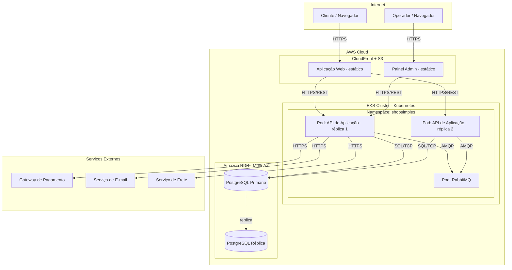

# 🌐 Visão Física (Implantação) — ShopSimples

> Parte do Modelo 4+1 de Visões Arquiteturais. Esta visão mapeia os componentes de
> software para os **recursos de infraestrutura** onde o sistema efetivamente roda.

---

## 1. Objetivo

Descrever onde cada container do **ShopSimples** (definidos em
[`diagramas/c2-container.puml`](../diagramas/c2-container.puml)) está hospedado,
considerando um cenário simples de implantação em nuvem.

---

## 2. Mapeamento de containers para infraestrutura

| Container (C4) | Infraestrutura | Observações |
| --- | --- | --- |
| Aplicação Web (React) | Amazon S3 + CloudFront | Build estático servido via CDN |
| Painel Administrativo (React) | Amazon S3 + CloudFront | Build estático separado, mesmo padrão |
| API de Aplicação (Node.js) | Contêineres em Kubernetes (EKS) | 2 réplicas mínimas, autoescalonamento horizontal |
| Banco de Dados (PostgreSQL) | Amazon RDS (Multi-AZ) | Backup automático diário, réplica de leitura opcional |
| Fila de Processamento (RabbitMQ) | Contêiner em Kubernetes (EKS) com volume persistente | Pode evoluir para Amazon MQ se a carga crescer |

---

## 3. Diagrama de Implantação

---

## 4. Requisitos não-funcionais de infraestrutura

| Requisito | Estratégia adotada |
| --- | --- |
| Alta disponibilidade da API | Mínimo 2 réplicas em pods distintos, balanceadas por Service do Kubernetes |
| Disponibilidade do banco | RDS Multi-AZ com failover automático |
| Segurança em trânsito | TLS obrigatório em todas as comunicações externas e entre serviços |
| Escalabilidade | Horizontal Pod Autoscaler (HPA) na API, baseado em uso de CPU |
| Observabilidade | Logs centralizados e métricas básicas de latência/erro por pod |

---

## 5. Rastreabilidade

| Recurso de infraestrutura | Container (C2) | ADR relacionada |
| --- | --- | --- |
| EKS — API de Aplicação | API de Aplicação | [`ARCH-001`](../adrs/ARCH-001-fluxo-finalizacao-compra.md) |
| RDS PostgreSQL | Banco de Dados | [`ARCH-001`](../adrs/ARCH-001-fluxo-finalizacao-compra.md) |
| RabbitMQ em Kubernetes | Fila de Processamento de Pedidos | [`ARCH-001`](../adrs/ARCH-001-fluxo-finalizacao-compra.md) |
