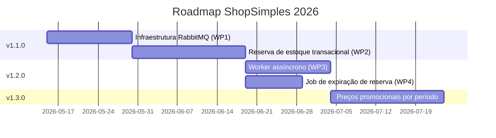

# 🗺️ Roadmap 2026 — ShopSimples

> Roadmap de evolução arquitetural do ShopSimples, com work packages rastreáveis às
> ADRs que os originaram.

---

## Marcos (Releases)

| Versão | Tema | Work Packages | ADR de origem | Status |
| --- | --- | --- | --- | --- |
| `v1.1.0` | Infraestrutura de mensageria e reserva de estoque transacional | WP1, WP2 | [`ARCH-001`](../adrs/ARCH-001-fluxo-finalizacao-compra.md) | Em andamento |
| `v1.2.0` | Processamento assíncrono pós-pedido (e-mail, NF, expiração de reserva) | WP3, WP4 | [`ARCH-001`](../adrs/ARCH-001-fluxo-finalizacao-compra.md) | Planejado |
| `v1.3.0` | Gestão de catálogo com preços promocionais por período | A definir | _A definir_ | Backlog |

---

## Visão de longo prazo

---

## Como este roadmap se relaciona com os demais artefatos

- Cada work package referenciado aqui é detalhado na seção **7. Roadmap e Plano de
  Transição** da ADR correspondente (`docs/adrs/`).
- Mudanças neste roadmap devem ser registradas como uma nova linha na tabela
  `[Unreleased]` do `CHANGELOG.md`, com link para a ADR que motivou a alteração.
